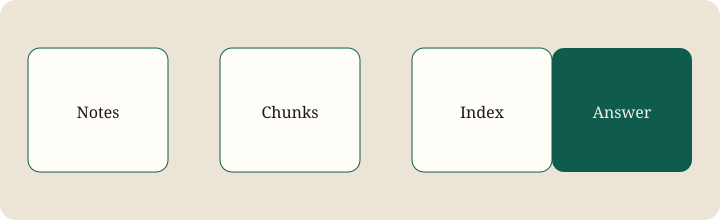

Keep the source material on the machine that already has it. The assistant should retrieve passages, cite them, and only then ask a local or remote model to write.

This hub is the placeholder for that project: why it matters, how retrieval should work, and the open questions still on the desk.

The first version can be boring. A folder of Markdown, a chunk index, and a prompt that refuses to invent a citation.
